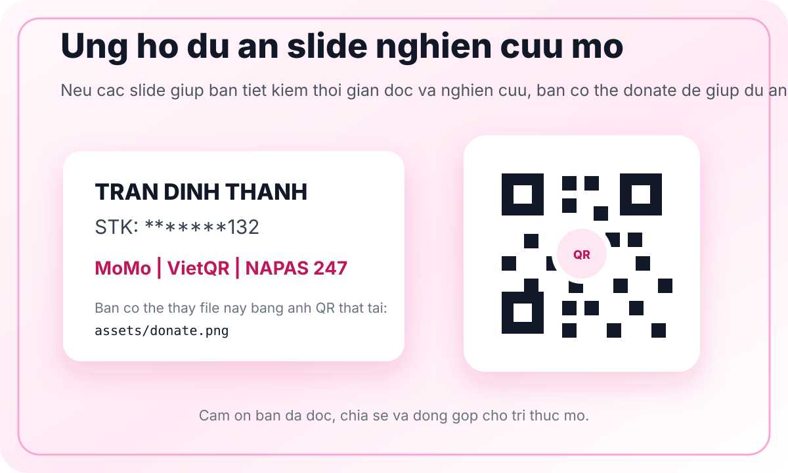

# Thư viện slide nghiên cứu cộng đồng

Repo này lưu các slide HTML mình tạo ra trong quá trình đọc sách, báo cáo, nghiên cứu và tài liệu chuyên sâu. Mục tiêu rất đơn giản: mình đọc gì, cộng đồng có thể cùng đọc và nghiên cứu cái đó qua một bản slide dễ tiếp cận hơn.

Các deck ở đây không nhằm thay thế tài liệu gốc. Chúng là bản tổng hợp, diễn giải, trực quan hóa và tổ chức lại nội dung để việc học, thảo luận và tra cứu nhanh hơn.

## Đang có gì?

| Nhóm | Chủ đề | Slide HTML | Ghi chú |
|---|---|---|---|
| Chứng khoán | Volume Analysis | [Mở slide](Chứng%20khoán/volume-analysis-full/index.html) | Chuyển hóa tài liệu về phân tích volume thành deck HTML 92 slide |

Mỗi deck thường có:

- `index.html`: file slide HTML có thể mở trực tiếp trên trình duyệt.
- `assets/`: JavaScript, hình ảnh, chart assets và tài nguyên hiển thị.
- `input/` hoặc file nguồn đính kèm nếu được phép chia sẻ.

## Cách đọc slide

Mở file `index.html` của từng deck trên trình duyệt.

Phím điều hướng:

- `←` / `→`: lùi / tới slide
- `Space`: tới slide kế tiếp
- `Home` / `End`: về đầu / tới cuối deck
- `F`: fullscreen

Nếu repo được publish bằng GitHub Pages, link public sẽ có dạng:

```text
https://<username>.github.io/<repo>/<folder>/<deck-folder>/
```

Ví dụ:

```text
https://<username>.github.io/<repo>/Chu%CC%9B%CC%81ng%20khoa%CC%81n/volume-analysis-full/
```

## Nguyên tắc chia sẻ

- Slide được viết cho mục đích học tập, nghiên cứu và thảo luận cộng đồng.
- Nội dung có thể được tóm tắt, cấu trúc lại, trực quan hóa và diễn giải lại từ tài liệu gốc.
- Số liệu, chart, bảng và trích dẫn nên có nguồn trong slide hoặc trong file nguồn kèm theo.
- Vui lòng tự kiểm tra tài liệu gốc trước khi dùng cho quyết định đầu tư, pháp lý, y tế, tài chính hoặc công việc có rủi ro cao.
- Nếu tài liệu gốc có bản quyền, chỉ publish file nguồn khi bạn có quyền chia sẻ. Nếu không, chỉ nên publish slide tổng hợp và dẫn nguồn hợp lệ.

## Không phải lời khuyên đầu tư

Một số slide có thể liên quan đến thị trường, tài chính hoặc chứng khoán. Nội dung trong repo này chỉ phục vụ học tập và nghiên cứu, không phải khuyến nghị mua bán hay lời khuyên đầu tư.

## Assets

Repo có thư mục `assets/` cho tài nguyên dùng chung:

- `assets/donate.svg`: thẻ donate dùng trong README.
- Có thể thay bằng ảnh QR thật tại `assets/donate.png` nếu muốn hiển thị QR chuyển khoản trực tiếp.

## Đóng góp

Bạn có thể đóng góp bằng cách:

- Báo lỗi hiển thị trong slide.
- Đề xuất sách, báo cáo hoặc tài liệu nên chuyển thành slide.
- Tạo issue nếu phát hiện nội dung sai, thiếu nguồn, chart khó đọc hoặc cần bổ sung góc nhìn.
- Chia sẻ repo cho người cùng quan tâm.

## Ủng hộ dự án

Nếu các slide này giúp bạn tiết kiệm thời gian đọc và nghiên cứu, bạn có thể ủng hộ để mình tiếp tục chuyển hóa thêm sách, báo cáo và tài liệu chuyên sâu thành slide công khai.



Thông tin donate:

- Tên: Trần Đình Thành
- STK: `*******132`
- Kênh: MoMo / VietQR / NAPAS 247

Nếu bạn có ảnh QR gốc, lưu vào `assets/donate.png` và đổi dòng ảnh trong README thành:

```md

```

## Cấu trúc repo

```text
.
├── README.md
├── assets/
│   └── donate.svg
└── Chứng khoán/
    └── volume-analysis-full/
        ├── index.html
        ├── assets/
        └── input/ hoặc file nguồn nếu được phép chia sẻ
```

## License và ghi chú bản quyền

Phần slide do mình tạo ra có thể được chia sẻ cho mục đích học tập và nghiên cứu cộng đồng, trừ khi từng deck có ghi chú khác.

Tài liệu gốc, sách, hình ảnh và dữ liệu bên thứ ba vẫn thuộc về chủ sở hữu tương ứng. Khi fork, chia sẻ lại hoặc trích dẫn, vui lòng tôn trọng license và bản quyền của nguồn gốc.
